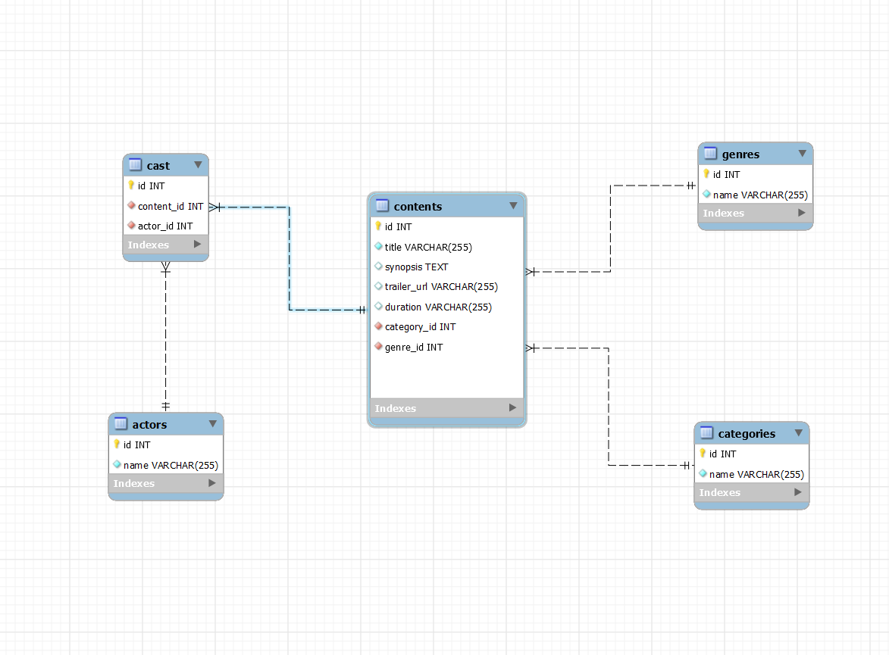

# Documentación de la API Trailerflix

## Tecnologías Utilizadas

- **JavaScript**: Lenguaje de programación.
- **MySQL**: Sistema de gestión de bases de datos SQL.
- **dotenv**: Para gestionar variables de entorno.
- **Express**: Framework web para Node.js.
- **Node.js**: Entorno de ejecución para JavaScript en el servidor.
- **Sequelize**: ORM para Node.js para interacción con bases de datos MySQL.

## Tablas relacionales

- Se crearon 5 tablas: contents, cast, genres, actors y categories. 
- Las mismas se relacionaron como muestra la imagen a continuación: 



## Requisitos

- Node.js y npm instalados.
- MySQL istalada y en funcionamiento.
- Dependencias con `npm install`.

## Pasos para instalación

1. Clonar el repositorio:

    ```bash
    git clone <https://github.com/jorgelinasigal/finalproject>
    ```

2. Navegar al directorio del proyecto:

    ```bash
    cd finalproject
    ```

3. Instalar las dependencias:

    ```
    npm install
    ```

4. Configurar la base de datos
- Crea la base de datos trailerflix_db en MySQL
- Ejecuta en MySQL el contenido del archivo trailerflix.sql
- Configura el archivo .ENV
```
DB_HOST="localhost" 
DB_USER="root" (Es importante verificar que coincida con el nombre de usuario en MySQL)
DB_PASS="" (Se debe modificar para que coincida con la password de MySQL de cada usuario)
DB_NAME="Trailerflix" 
PORT=3000 
```

5. Ejecuta el servidor:

    ```bash
    node index.js
    ```

## Endpoints


| URL | Función | Parámetros |
|------|---------|------------|
| [http://localhost:3008/](#1-Muestra-una-presentación-con-portada) | Muestra una presentación con portada | Ninguno |
| [http://localhost:3008/content](#2-Obtener-todos-los-Items) | Obtener todos los Items | Ninguno |
| [http://localhost:3008/peliculas](#3-Obtiene-todas-las-películas) | Obtiene todas las películas | Ninguno |
| [http://localhost:3008/series](#4-Obtiene-todas-las-series) | Obtiene todas las series | Ninguno |
| [http://localhost:3008/cast/:id](#5-Buscar-items-por-id) | Buscar items por id | `id` - Id del item |
| [http://localhost:3008/cast/:name](#6-Buscar-items-por-actor) | Buscar items por actor| `name` - Nombre del actor |
| [http://localhost:3008/peliculas?name={name}](#7-Buscar-pelicula-por-título) | Buscar pelicula por título | `name` - Nombre de la pelicula |
| [http://localhost:3008/series?name={name}](#8-Buscar-serie-por-título) | Buscar serie por título | `name` - Nombre de la serie |

### 1. Muestra una presentación con portada

- **Método**: `GET`
- **Ruta**: `/`
- **Descripción**: Muestra una presentación con botones de accesibilidad y portada.

[Volver a endpoints](#endpoints)


### 2. Obtener todos los Items

    Método: GET
    Ruta: /content
    Descripción: Obtiene todos los contenidos con paginación. Se calcula el desplazamiento según la pagina solicitada y se limita el número de elementos por página. Los datos se transforman para coincidir con los nombres de propiedad esperados en la vista y se renderiza la plantilla 'content' con los datos de los contenidos y la información de paginación.

Ejemplo de solicitud:

```bash
http://localhost:3008/content
```
Respuesta:

(./image1.png)


[Volver a endpoints](#endpoints)

### 3. Obtiene todas las películas

    Método: GET
    Ruta: /peliculas
    Descripción: Obtiene todas las películas. Opcionalmente pueden ser filtradas por el nombre proporcionado en los parámetros de consulta (req.query) como se mencionara mas adelante. 

Ejemplo de solicitud:

```bash

http://localhost:3008/peliculas
```
Respuesta:

(./pelis.png)


[Volver a endpoints](#endpoints)

### 4. Obtiene todas las series

    Método: GET
    Ruta: /series
    Descripción: Obtiene todas las series. Opcionalmente pueden ser filtradas por el nombre proporcionado en los parámetros de consulta (req.query) como se mencionara mas adelante. 

Ejemplo de solicitud:

```bash

http://localhost:3008/series

```
Respuesta:

(./series.png)


[Volver a endpoints](#endpoints)

### 5. Buscar items por id

    Método: GET
    Ruta: /cast/:id
    Descripción: Obtiene un elenco por ID. La respuesta incluye información sobre el elenco, el actor y el contenido asociado.

Ejemplo de solicitud:

```bash

http://localhost:3008/cast/:id

```
Respuesta:

(./castid.png)


[Volver a endpoints](#endpoints)

### 6. Buscar items por actor

    Método: GET
    Ruta: /cast/:name
    Descripción: Obtiene un elenco por nombre de actor. La respuesta incluye información sobre el elenco, el actor y el contenido asociado.

Ejemplo de solicitud:

```bash

http://localhost:3008/cast/:name

```
Respuesta:

(./castac.png)


[Volver a endpoints](#endpoints)

### 7. Buscar pelicula por título

    Método: GET
    Ruta: /peliculas?name={name}
    Descripción: Permite opcionalmente filtrar por el nombre proporcionado en los parámetros de consulta (req.query) a las peliculas. La respuesta se transforma para coincidir con los nombres de propiedad esperados en la vista y se renderiza la plantilla Pelicula. 

Ejemplo de solicitud:

```bash

http://localhost:3008/peliculas?name={name}

```
Respuesta:

(./pelisname)


[Volver a endpoints](#endpoints)

### 8. Buscar serie por título

    Método: GET
    Ruta: /series?name={name}
    Descripción: Permite opcionalmente filtrar por el nombre proporcionado en los parámetros de consulta (req.query) a las series. La respuesta se transforma para coincidir con los nombres de propiedad esperados en la vista y se renderiza la plantilla Pelicula. 

Ejemplo de solicitud:

```bash

http://localhost:3008/series?name={name}

```
Respuesta:

(./seriename/png)


[Volver a endpoints](#endpoints)

### Trabajo Final 

Grupo conformado por:

|--Macarena Ferro
|--Jorgelina Sigal
|--Junixza Briceño